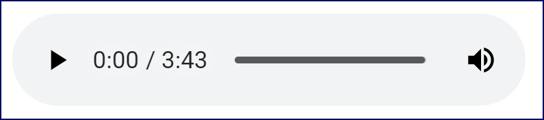

# HTML Elements, Attributes, and Comments

HTML elements describe the structure and content of a web page. Tags are used to indicate the beginning and end of elements. The syntax is as follows:

` <tagname>Element content</tagname> `

## Attributes
Tags often have attributes for further defining the element. Attributes usually come in name-value pairs.

Note that attributes only appear in the opening tag, like so:

` <tagname att1="value" att2="value">Element content</tagname> `

There are some attributes that do not need to take a value. You can think of them as being “on” when the attribute is present and “off” when it is not. For example:

` <tagname att>Element content</tagname> `  <--- CONTAINER 

The order of attributes is not important.

## Empty vs. Container Tags

The tags shown above are called container tags because they have both an opening and closing tag with content contained between them.
Tags that do not contain content are called empty tags. The syntax is as follows:

 ` <tagname /> `

 or

 ` <tagname att1="value" att2="value" /> `


## Shortcut Close
  Empty tags may also be written as follows:

  ` <tagname /> `

 or

  ` <tagname att1="value" att2="value" /> `

The forward slash `/` at the end, just before the close angle bracket `>`, explicitly indicates that this tag is closed.
In general, it is not necessary to use this shortcut close, but it also doesn’t cause any harm. Our only recommendation is that if you use it, use it consistently.

# Block and Inline Elements

## Block-level Elements 

Block-level elements are elements that separate a block of content. For example, a paragraph `(<p>)` element is a block-level element. Other block-level elements include:

```js
Lists (<ul> and <ol>)
Tables (<table>)
Forms (<form>)
Divs (<div>)
```

# Inline Elements
Inline elements are elements that affect only snippets of content and do not block off a section of a page. Examples of inline elements include:

"Snippet" is a programming term for a small region of re-usable source code, machine code, or text.

```js
Links (<a>)
Images ()
Form elements (<input>, <button>, <select>, <textarea>, etc.)
Phrase elements (<em>, <strong>, <code>, etc.)
Spans (<span>) – wraps text without giving it any special meaning. Meaning and style can be applied through its attributes.
```

## Comments
HTML comments are enclosed in <!-- and -->.

For example:

<!-- This is an HTML comment -->

Comments are generally used for one of two purposes:

To write helpful notes about the code; for example, why something is written in a specific way.
To comment out some code that is not currently needed, but may be used sometime in the future.

# The HTML Skeleton

At its simplest, an HTML page contains what can be thought of as a skeleton:
The main structure of the page. It looks like this:

```js
<!DOCTYPE html>
<html lang="en">
<head>
<meta charset="UTF-8">
<meta name="viewport" content="width=device-width, initial-scale=1">
<title></title>
</head>
<body>
  <!--
    Content that appears on the page goes in the body
    (but I won't show up because I'm in a comment).
  -->
</body>
</html>

```

## The <head> Element

The <head> element contains content that is not displayed on the page itself.
Some of the elements commonly found in the head are:

1. Title of the page (<title>). Browsers typically show the title in the “title bar” at the top of the browser window:Title bar shown in browser
2. Meta tags (<meta>), which contain descriptive information about the page.
3. Script blocks (<script>), which contain JavaScript code for adding functionality and interactivity to a page.
4. Style blocks (<style>), which contain Cascading Style Sheet rules for formatting a page (CSS).
5. References or links to external style sheets (<link>).

Here is an example head element:

`
<head>
  <meta charset="UTF-8">
  <meta name="viewport" content="width=device-width, initial-scale=1">
  <link href="styles.css" rel="stylesheet">
  <script src="script.js"></script>
  <title>Dummy title</title>
</head>
`

## The body Element
The body element (<body>) contains all of the content that appears on the page itself. Tags that can be placed within the <body> tag will be covered thoroughly throughout these lessons.

## Whitespace
Extra whitespace is ignored in HTML. This means that all hard returns, tabs, and multiple spaces are condensed into a single space for display purposes. Review the following demo:

```html
<!DOCTYPE html>
<html lang="en">
<head>
<meta charset="UTF-8">
<meta name="viewport" content="width=device-width, initial-scale=1">
<title>Whitespace Example</title>
</head>
<body>
This is a sentence on a single line.

This
    is
    a
        sentence with
    extra whitespace
throughout.

</body>
</html>
```

If you open this in your browser. You will see that the two sentences in the code above will be rendered in exactly the same way. Notice that all extra whitespace is ignored:

Whitespace in your code is condensed unless it is in which tag?
The `<pre>` tag preserves both spaces and line breaks as they are in the HTML source, displaying them exactly as they appear in the code.

<!-- 
Why is extra whitespace ignored ?
Browsers ignore extra whitespace so that web developers can use hard returns, spaces, and tabs to make their code readable. For example, we like to limit the length of one line of HTML code to 120 characters as this makes it easier to read the code. But we don’t want text that we send to the browser to also be limited to 120-character lines.
-->

Special Characters
Special characters (e.g., characters that do not show up on your keyboard) can be added to HTML pages using entity names and numbers. For example, a copyright symbol (©) can be added using &copy; or &#169;. The following table shows some of the more common character references:

# HTML Entities
Special characters (e.g., characters that do not show up on your keyboard) can be added to HTML pages using entity names and numbers. For example, a copyright symbol (©) can be added using &copy; or &#169;. The following table shows some of the more common character references: 

```md
DESCRIPTION	NUMBER:  NAME |	SYMBOL
Quotation mark	| &#34; | &quot;	"
Single quotation mark (apostrophe) | &#39; | &apos;	'
Ampersand |	&#38; |	&amp;	&
Less than |	&#60; |	&lt;	<
Greater than |	&#62; |	&gt;	>
Non-breaking space | &#160; | &nbsp;	
Cent sign |	&#162; | &cent;	¢
Pound sign | &#163; | &pound;	£
Yen sign |	&#165; | &yen;	¥
Euro sign |	&#8364; | &euro;	€
Copyright |	&#169; | &copy;	©
Registered trademark |	&#174; | &reg;	®
Trademark |	&#8482; | &trade;	™
Inverted question mark | &#191; | &iquest;	¿
Inverted exclamation mark |	&#161; | &iexcl;	¡
Fraction: one-fourth |	&#188; | &frac14;	¼
Fraction: one-half | &#189; | &frac12;	½
Fraction: three-fourths | &#190; | &frac34;	¾
En dash	| &#8211; |	&ndash;	–
Em dash	|&#8212; | &mdash;	—
Dagger | &#8224; |	&dagger;	†
Horizontal ellipsis | &#8230; |	&hellip;	…

```

## The lang Attribute
The lang attribute is used to tell the browser and other user agents the language contained within an element. While it is not required, the W3C recommends that lang be included in the <html> tag of all HTML documents, like so:

` <html lang="en"> `

According to the W3C, the lang attribute is helpful in:

Assisting search engines.
Assisting speech synthesizers.
Helping a user agent select glyph variants for high-quality typography.
Helping a user agent choose a set of quotation marks.
Helping a user agent make decisions about hyphenation, ligatures, and spacing.
Assisting spell checkers and grammar checkers.

# Paragraphs, Headings, and Text
This lesson discusses how to properly mark up text. With just a few exceptions, it does not discuss how to change the formatting or display of these elements. That is a task for CSS.

## Heading Levels 
HTML supports six levels of heading. The tags are `<h1>, <h2>, <h3>, <h4>, <h5>, and <h6>,` descending in importance from `<h1>` to `<h6>`. Headings are block-level elements. 

## Breaks and Horizontal Rules

The <br> tag forces a line break. The <hr> tag creates a horizontal rule across the page. The following code shows how they are used:

Notice that the <br> and <hr> tags are both empty tags, meaning that they do not contain any content, and therefore, do not have a corresponding closing tag.

## The div Tag
The div element (<div>) is used to create a content division. That is, it divides a segment of content from the surrounding content. Visually, this results in placing the content on its own block, similar in effect to putting a <br> tag before and after the content.

While the preceding demo illustrates how the div element works, it is more commonly used to separate larger blocks of content. You will learn more about this in the `Sectioning a Web Page lesson`.

## Quoted Text
The <blockquote> and <q> tags are used to designate quoted text. Both elements can take the cite attribute, which is used to reference the source. The value of the cite attribute, which is used to point to a URL with information about the quote, will not be visible on the page by default, but could be made accessible using JavaScript.

blockquote is a block-level element, while q is an inline element. See the following example:

```html
-------Lines Omitted-------
<body>
  <h1>The Declaration of Independence</h1>
  <p>The Declaration of Independence begins with the paragraph:</p>
  <blockquote
    cite="https://www.ushistory.org/declaration/document/index.html">
    <p>When in the Course of human events it becomes necessary for one
      people to dissolve the political bands which have connected them
      with another and to assume among the powers of the earth, the
      separate and equal station to which the Laws of Nature and of
      Nature's God entitle them, a decent respect to the opinions of
      mankind requires that they should declare the causes which impel
      them to the separation.</p>
  </blockquote>

  <p>The second paragraph, which begins
  <q cite="https://www.ushistory.org/declaration/document/index.html">We
  hold these truths to be self-evident, that all men are created
  equal...</q> is more widely known.</p>
</body>
-------Lines Omitted-------
```
Some Notes :
1. Most browsers add margins to blockquotes on both the left and right and wrap text nested in <q> tags with quotes. Google Chrome renders this page as follows:Display of Quote Example Declaration of Independence
Some notes:

2. Modern browsers don’t do anything visual with the cite attribute.
Blockquotes should not be used for formatting purposes. If you want to add margins around an element, you should use Cascading Style Sheets (CSS).
3. Blockquotes cannot be contained within paragraphs.
4. Blockquotes cannot have text as a direct child. Usually, blockquotes contain paragraphs (<p> tags).

## Preformatted Text
Occasionally, it is desirable to output content as it is laid out in the code, whitespace and all. The <pre> tag is used for this purpose. It is often used in online coding tutorials so that the whitespace shown in the tutorial reflects how it would appear in the document it represents. The following code shows how <pre> is used:

```html
<!DOCTYPE html>
<html lang="en">
<head>
<meta charset="UTF-8">
<meta name="viewport" content="width=device-width, initial-scale=1">
<title>Preformatted Text</title>
</head>
<body>
<h1>Your First HTML Page</h1>
<pre>
&lt;!DOCTYPE html&gt;
&lt;html lang="en"&gt;
&lt;head&gt;
&lt;title&gt;Hello world!&lt;/title&gt;
&lt;/head&gt;
&lt;body&gt;
  &lt;h1&gt;Hello world!&lt;/h1&gt;
&lt;/body&gt;
&lt;/html&gt;
</pre>
</body>
</html>
```
Notice that the whitespace within the <pre> tags is not condensed. Remove the <pre> tags and this page will appear like this

## Inline Semantic Elements
Semantic (adj.): Of or relating to meaning, especially meaning in language.

Inline semantic elements provide meaningful information about the content they contain. The most common elements of this type are em and strong. Both elements indicate that the content should be emphasized. `<strong>` indicates stronger emphasis than `<em>`. Most browsers bold `<strong>` content and italicize `<em>` content. Inline semantic elements are listed below: 

`<abbr>` – Used for abbreviations. Use the title attribute for the unabbreviated version. Default styling varies.
`<b>` – Used to stylistically offset text without conveying any extra importance to it. Default styling is usually bold. Use sparingly, if at all.
`<cite>` – Used to cite a creative work. Default styling is usually italic.
`<code>` – Used to denote computer code. Default styling is usually monospace.
`<dfn>` – Used to indicate a term being defined. Default styling is usually italic.
`<em>` – Used to add emphasis to text. Default styling is usually italic.
`<i>` – Used to convey an alternate voice or mood. Default styling is usually italic. Use sparingly, if at all.
`<kbd>` – Used to denote user input (e.g., from a keyboard or a voice input). Default styling is usually monospace.
`<mark>` – Used to mark text of special interest or importance. Default styling is usually highlighted in some way.
`<s>` – Used to mark text as no longer accurate or relevant. Default styling is to put a line through the text.
`<samp>` – Used to denote output from a computer program. Default styling is usually monospace.
`<small>` – Used to represent text as a side comment or “small print.” Default styling is usually smaller than surrounding text.
`<span>` – Used as a generic wrapper of inline content. The <span> tag can be used for grouping elements, and meaning and style can be added through adding attributes (e.g., id, class, and lang).
`<strong>` – Used to add extra emphasis or importance to text. Default styling is usually bold.
`<sub>` – Used to denote a subscript.
`<sup>` – Used to denote a superscript.
<`time>` – Used to denote a date and/or time. It can include a datetime attribute with a machine-readable format of the enclosed date and/or time.
`<u>` – Indicates that text should have some form of non-textual annotation applied. By default, this is an underline, but if you use this element, you should probably change the default rendering to something different, so that it doesn’t look like a link. Avoid using the <u> tag unless you have a specific semantic use case such as drawing attention to spelling or grammatical errors.

All of these formatting effects can be created with CSS, so if you just want to change the formatting without implying any specific meaning, you should use CSS instead.

We recommend avoiding the <b> and <i> tags. In most cases, <strong> and <em> are more appropriate.

# HTML Links
The ability to link from one page to another is what makes HTML hyper. Calling it Hypertext, however, is a bit of a misnomer, as images can also be linked.

The "Root" is the top of the website.

## Text Links
The link tag is one of the least intuitive HTML tags. It is <a>, short for “anchor.” The <a> tag was originally used to create anchor points within a page, which could then be linked to. By itself, the <a> tag does nothing. To create a link, it requires the href attribute, which specifies the path to the file or location. The syntax is as follows:

  ` <a href="path_to_file">Link Text</a> `
  
A couple of examples:

`<a href="bios/john-lennon.html">John Lennon</a>`
`<a href="https://www.webucator.com">Webucator</a>`

## Absolute vs. Relative Paths
Paths are absolute or relative:

- Absolute paths always start from the top-level directory (the web root) and work their way downward toward the referenced file.
- Relative paths start from the current location (the location of the file containing the path) and work their way to the referenced file from that location.


### Things to notice:

The index.html file on the bottom is a direct child of the wwwroot folder.
The about, bios, and images folders are also children of the wwwroot folder. They each contain their own files.

Assume that this site is located at https://www.example.com and that the wwwroot folder is the web root, meaning that it is the top-level directory. This means that when a user visits https://www.example.com/index.html, the index.html page within the wwwroot folder will be downloaded to the browser.

- Absolute Paths

An absolute path shows the complete path to a file starting from the web root.

The absolute path to the web root from a page on the same domain is simply a forward slash (/). So, given the folder structure shown above, a link on company.html to index.html could be written like this:

  `<a href="/index.html">Home Page</a>`

The same link could be placed on any page in any folder below the wwwroot folder or on any page in the wwwroot folder itself.

Using an absolute path, a link to company.html would include the about directory, like this:

  `<a href="/about/company.html">About Our Company</a>`

External Links
When linking to a file at a different domain, you must identify the location of the domain using the domain name (or IP address) of the site. Again, assume that the directory structure shown above is found at https://www.example.com. A link to company.html from another site would be written like this:

  `<a href="https://www.example.com/about/company.html">About the Beatles</a>`

### Relative Paths

Relative paths can only be used to link to other files under the same web root. A relative path indicates where a file is relative to the file that contains the link. The folder (or directory) that contains the file being worked on is called the current directory. The relative path to another file that is also in the current directory is just the name of that file. For example, since company.html and contact.html are found in the same directory, they can link to each other simply by specifying the file name. The following shows a link that could be used in contact.html to company.html:

  `<a href="company.html">About Our Company</a>`

The relative path to a file in a subdirectory of the current directory must include the name of the subdirectory. For example, to link to company.html from index.html you must first point to the about directory, like so:

`  <a href="about/company.html">About Our Company</a>`

The relative path to a file in a directory above the current directory should begin with “../”. For example, the following shows a link to index.html from company.html:

`  <a href="../index.html">Home Page</a>`

### Default Pages

The web server administrator can set up default page names to look for when a path ends with a directory name without specifying a file. Often these files are called index.html. In this case, the following URLs would be identical, all loading index.html:

  `https://www.example.com`
  `https://www.example.com/`
  `https://www.example.com/index.html`

You can give this a try by visiting those pages at example.com, which is an actual website used for demonstrating just this sort of thing:


## Targeting New Tabs
The target attribute is used to specify the browser tab (or window) in which the linked page will open. For example:

  `<a href="company.html" target="newtab">Our Company</a>`

If there is no open browser tab with the specified target name, a new tab will be opened with that name. As long as that tab stays open, future links with the same target value will target that tab.

Note that “newtab” has no special meaning. We could name it “external,” “newwin,” “roxanne,” or anything else we want.

Try it out by doing the following:

1. Open Links/Demos/links.html in Visual Studio Code and review the first two links below the Targeting New Tabs heading:
 ` <a href="https://www.amazon.com" target="newtab">Amazon</a>`
 ` <a href="https://www.nytimes.com" target="newtab">NY Times</a>`

2. Open Links/Demos/links.html in your browser.
3. Under Targeting New Tabs, click the Amazon link:


This link has a target of newtab. The page will open in a new tab:

  

4. Without closing the tab with Amazon in it, go back to the tab that has links.html open.
5. Under Targeting New Tabs, click the NY Times link. This link also has a target of newtab. The page will open in the same tab in which Amazon opened:

  

Other links targeting newtab would also open in that same tab.

### _blank Target
To force each link to target a brand new tab or window, use _blank as the value of the target attribute as shown here:

  `<a href="company.html" target="_blank">Our Company</a>`

Try it out by doing the following:

1. Open Links/Demos/links.html in Visual Studio Code and review the third link below the Targeting New Tabs heading:

  `<a href="https://www.webucator.com" target="_blank">Webucator</a>`

2. Open Links/Demos/links.html in your browser if it’s not already open.
3. Under Targeting New Tabs, click the Webucator link:

  

This link has a target of _blank. The page will open in a new tab:

  

4. Without closing the tab with Webucator in it, go back to the tab that has links.html open.
5. Under Targeting New Tabs, click the Webucator link again. Rather than reusing the same tab, it will open the page in another brand new tab:

  

As a rule of thumb, if you’re going to have links open in new tabs, use a named target rather than the generic _blank, so that the user doesn’t get inundated with new tabs.

As an even more important rule of thumb, avoid targeting new tabs/windows altogether. Some websites do this so that the linked page will not replace their web page, but it is bad design. Generally, you do not want to surprise your users, who are accustomed to clicking the Back button to get back to a page they were just on. When a link opens in a new tab or window, users cannot click the Back button to get back to your page. Instead, they have to know to go back to the tab that your page is on, making it even more difficult to get back to your page. An exception would be when you are quite certain that the user wants to stay on your page because they are following a setup guide or a tutorial. In this case, it can be helpful to target new tabs, so that the user can easily toggle back and forth between the instructions they are following and the linked pages.

## Email Links
Email links are used to open an email client to start a new email message. The syntax is similar to the links we have seen thus far. However, for email links, the value of the href attribute must begin with mailto: and ends with an email address. For example:

  `<a href="mailto:paul@example.com">Email Paul</a>`

It is good practice to include the email address as the text of the link, so that people who are printing the page or whose setup does not support email links can see the actual email address. For example:

  `Email Paul at <a href="mailto:paul@example.com">paul@example.com</a>`

##  Adding Links
In this exercise, you will add links to the pages of the Runners Home website. The home page (Links/Exercises/index.html) looks like this:

  

The links above the footer should go to the following pages:

  

The footer links should go to:

15. info@runners-home.com. This should be an email link.
16. https://www.facebook.com/webucator
17. https://www.linkedin.com/companies/webucator
18. https://twitter.com/webucator

After you have finished adding links to the home page, open each of the other pages in the Links/Exercises folder and add the same header and footer links that you added in index.html. Copy and paste is your friend, but be careful: relative links on pages in subfolders will be different from links in the root folder and from links in other subfolders.

In addition to the header and footer links, add the following links:

1. aces.html
“AJC Peachtree Road Race”: https://www.atlantatrackclub.org/peachtree
“Boilermaker”: https://www.boilermaker.com
“NYC Marathon”: https://www.nyrr.org/
2. advice/index.html
“Running Tips”: the Running Tips page.
“Health Tips”: the Health Tips page.
3. advice/health-tips.html and advice/running-tips.html
“More Advice Articles”: Running Advice index page.
4. resources/index.html
“Calculator”: the Calculator page.
“Running Log”: the Running Log page.
“Running Terms”: the Running Terms page.
“Links”: the Links page.
5. resources/links.html
“Map My Run”: https://www.mapmyrun.com
“Runners World”: https://www.runnersworld.com
“Strength Running”: https://strengthrunning.com
“More Resources”: Resources index page.

6. resources/calculator.html, resources/run-log.html, and resources/terms.html

“More Resources”: Resources index page.
You may find Visual Studio Code’s Compare Selected tool useful for comparing the solutions you did in the Exercises folder with the ones we included in the Solutions folder.

1. In Visual Studio Code’s Explorer panel, hold down the `Ctrl` key (Windows) or `Cmd` key (Mac) and click the two files you wish to compare. They should become highlighted.
2. Right-click one of the files and select Compare Selected:

  

3. You will get a side-by-side view of the files with differences highlighted.
4. Close the files when you are done comparing them:

  

## The title Attribute
The title attribute can be used to provide a description about a link. The description is displayed by the browser as a tooltip. Screen readers might read the description to a blind user.

Here’s an example:

  `<a href="https://www.webucator.com" title="Webucator Home Page">Webucator</a>`

  When you hover over this link, the title appears as a tip:

  

This is especially useful when using an image as a link as it might not be clear from the image itself where the link points. The title attribute can be used to make the link destination clear. You will learn how to do this in the next lesson.

## Targeting a Specific Location on the Page
Every HTML element can take an id attribute, which uniquely identifies that element on the page. The value of the id attribute must not contain any whitespace.

To target a specific element on the page, the link’s href value should point to that element’s id attribute prefaced with a number sign.

For example, assume you have an <h2> tag with the id of “john”:

  `<h2 id="john">John Lennon</h2>`

To target that location, use:

  `<a href="#john">Read about John</a>`

You can also link to locations on other pages:

  `<a href="about.html#john">Read about John</a>`

Or:

  `<a href="https://www.example.com/about.html#john">Read about John</a>`

The following file shows more examples:
Links/Demos/location-links.html

The “top” Keyword
You will notice in the demo that the last link is to “#top”, but there is no element on the page with the id “top”. That is because “top” is a keyword. Browsers know that “top” references the top of the page.

# HTML Images
Modern browsers support several types of images, including:

- Graphics Interchange Format (GIF)
- Joint Photographic Expert Group image (JPEG)
- Portable Network Graphics (PNG)
- Scalable Vector Graphics (SVG)
- Web Picture format (WebP)

WebP is generally the best choice for both image quality and compression and is supported by Chrome, Edge, Firefox, Opera, and Safari, but not by Internet Explorer.

## Inserting Images
The `` tag is used to include an image in an HTML page. The `` tag is an empty tag, meaning it has no closing tag. Its src attribute is used to reference an image file using a relative or absolute path. Here is the syntax:

  ``

The following demo shows how to use the  tag:

Images/Demos/images.html

The page will render as follows:
  

## Making Images Accessible
Alternative Text

To add alternative text for an image, use the alt attribute as shown below:

  ``

Alternative text is displayed…

When the user’s browser does not support images.
As the image is downloading.
When the user hovers over the image with the mouse (in some browsers).
Most importantly, alternative text is used by screen readers to describe an image for the visually impaired.

Note: If an image depicts something complicated, such as a graph or chart,a longer description of the image can be provided using the aria-describedby attribute.

## height and width Attributes
The img element also takes height and width attributes that set the dimensions (in pixels) to use to display the image on the page. It is not good practice to “resize” the image using these attributes. If you use these attributes, you should set the values to the actual height and width of the image. Using the height and width attributes lets the browser know how much space to allocate for the image without having to wait for the image itself to download. Use of these attributes may promote faster rendering of the web page:

  ``

## Image Links 
To create an image link, wrap an <a> tag around your image, like so:

```html 
<a href="index.html" title="Link to Home Page">
  
</a>
```

The following demo shows some image links:
 Images/Demos/image-links.html

Including the title attribute results in a tooltip in many browsers:


## Adding Images to the Page

In this exercise, you will add images to index.html. Here is the resulting page:


1. Open Images/Exercises/index.html for editing.
2. Add the following images, all of which are in the Images/Exercises/images directory. Be sure to include alternative text.

A. runners-home.png should link to index.html.


B. tips-running.png should link to advice/running-tips.html


C. tips-health.png should link to advice/health-tips.html.


D. facebook-icon.png, linkedin-icon.png, and twitter-icon.png should replace the text used in the footer of the exercise file.

Solution: Images/Solutions/index.html

## Providing Alternative Images

All modern browsers support the newer WebP image format, which offers better quality and compression than PNG, JPEG, and GIF images. However, 
Internet Explorer does not support WebP. This may not be an issue as Internet Explorer has a very small share of the market. If you need to support Internet Explorer,
you can still use WebP images by providing fallback images using the picture element. Here is an example:

```html
<picture>
  <source srcset="images/logo.webp" type="image/webp">
  
</picture>
```

Notice that the picture element has a child source element with a srcset attribute that points to the image file and a type attribute that indicates the image format.
If the browser supports that image format, it will use that file. If not, it will fall back on the image file specified in the subsequent img element.

Note on WebP:
For more information on WebP and a free tool for converting PNG and JPG files to WebP,
see https://developers.google.com/speed/webp.

# HTML Lists
There are three types of lists in HTML: unordered, ordered, and description lists.
In this lesson, you will learn how to create all three.

## Unordered Lists
Unordered lists are rendered as bulleted lists. Take a look at the following code sample:
Lists/Demos/beatles-unordered.html

The <ul> tag starts an unordered list. Each list item is contained in <li></li> tags.
The following screenshot shows how this code would be rendered:


## Nesting Unordered Lists
Unordered lists can also be nested.
Browsers use indentation and different styles of bullets to display the nested lists.
The following example shows how this works:
Lists/Demos/beatles-unordered-nested.html

Notice that the nested unordered lists are siblings to plain text. For example, the text “George Harrison” and the
unordered list that follows that text are both contained within the same parent <li> tag.
Only list items, not lists themselves, can contain nested (i.e., child) lists.
In other words, lists contain list items, which can contain lists, which contain list items,
which can contain lists, and so on and so forth, ad infinitum.

Here is the resulting page:


# Ordered Lists
Ordered lists are similar to unordered lists.
They are created with the <ol> tag and, by default, will display list items with numbers.
Take a look at the following code:

Lists/Demos/beatles-ordered.html

The following screenshot shows how the code will be rendered:


Nesting Ordered Lists
Like unordered lists, ordered lists can be nested. However, unlike in some word processing applications,
nested ordered lists will continue to be displayed using standard numbers:

Lists/Demos/beatles-ordered-nested.html

The resulting page looks like this:


As you can see, ordered lists can contain nested unordered lists (below Can’t Buy Me Love). The reverse is also true.

## The type Attribute
The type attribute is used to change the numbering type. Possible values are shown in the following table:

Values of the type Attribute
Value	Description
i | Lowercase Roman Numerals
I	| Uppercase Roman Numerals
a	| Lowercase Letters
A	| Uppercase Letters
1	| Numbers (default)
The following code illustrates how type is used:

Lists/Demos/beatles-ordered-nested-type.html
Here is the resulting page:


Note: List Types and CSS:
As a rule, it is better to set the type of numbering using the CSS list-style-type property.
The exception is when the value of the list item is meaningful, as it sometimes is in legal or technical documents.
This is because you cannot be sure that CSS will be enabled.

Also note that the unordered list tag (<ul>) used to have a type attribute as well,
but this has been deprecated in favor of CSS, so you should not use it.

The start Attribute

The start attribute is used to specify what number the list should start on. It takes an integer value. For example:
Lists/Demos/fifth-beatle.html

The following screenshot shows how the code will be rendered:


# Description Lists
Description lists are used to define a list of terms. The following example is a modified version of an example from the W3C Recommendation:

https://www.w3.org/TR/html4/struct/lists.html#edef-DD

Look at Lists/Demos/description-list.htm:

1. The <dl> tag contains the description list.
2. The <dt> tags contain the description terms. Notice that these contain <dfn></dfn> tags, which are used to indicate the term being {defined}.
3. The <dd> tags contain the description {details}.
The following screenshot shows how the code will be rendered:


4. Abbreviations are contained within ABBR <abbr> tags:
  `<dt><abbr title="HyperText Markup Language">HTML</abbr></dt>`

## Creating Lists
In this exercise, you will add several lists to the Runners Home website.

Navigation Menu
On all the pages, you will update the main navigation at the top to look like this:


Notice that there is a nested list under Resources.

In addition to the main navigation list, add the following lists:

1. index.html – Add an ordered list under Purpose on the home page


2. races.html – Add an ordered list with nested unordered lists to the page:


3. resources/index.html – Add an unordered list: 


4. resources/terms.html – Add a description list to the page:


5. resources/links.html – Add an unordered list to the page:


6. advice/index.html – Add an unordered list to the page:


*Go to solutions in Lists Folder*(Is it correct ?)

#  HTML Tables
In the old days of web development, tables were often used for laying out pages. Today, layout is done with CSS. Tables should be used exclusively for marking up tabular data. In this lesson, you will learn how to create them.

## Creating Tables
Tables are made up of one or more table rows, each of which contains one or more table cells. The tag for creating tables is <table>. The table row tag is <tr> and the two tags that can create table cells are <th> and <td>. Here is a simple table:

*Look At* Tables/Demos/table-homeruns.html

*NOTE* The `th` elements are table `header cells`. By default, their content will be `centered` and `bolded`. The `td` elements are table `data cells`. By default, their content will be `plain text` and `left-aligned`.

Adding a Caption

The table above has a caption, which is added by inserting the <caption> tag after the open <table> tag:

```html

<table>
  <caption>All-time Home Run Records</caption>
  <tr>...

```

The following image shows how this table will be rendered in the browser:


## thead, tbody, and tfoot

Table rows (tr elements) can be distributed into thead, tbody, and tfoot elements. If these elements are left off, it is assumed that all table rows are part of the tbody. We can illustrate this with Google Chrome

1. Open Tables/Demos/table-homeruns.html in Google Chrome.
2. Right-click anywhere on the page and select Inspect:


3. This will open Google Chrome’s Developer Tools on the Elements tab. You may need to click the tag names to open them:


From the above screenshot, you see that Google Chrome considers this table to have a tbody element even though there are no <tbody> tags in the code.

The first row really should be in a <thead> tag, and the rest of the rows should be in a <tbody> tag, so let’s fix that:

Tables/Demos/table-homeruns2.html

As you can see, we have broken up the rows into a thead section and tbody section. We have also added a new table row in a tfoot element.

The look of the page will not change, but when we inspect it with Google Chrome, we see that it now “sees” the different sections:


You may be wondering why separating table rows into sections is useful if the browser doesn’t display the different sections in different ways. Web pages are styled with CSS, and this separation makes it much easier to style different sections of the table to create a table like this:


This should help you understand xwhy it is useful to be able to identify the different sections.

## Merging Cells
In HTML tables, all table rows must span the same number of columns, and all table columns must span the same number of rows. Consider the following table, which has two rows:


Note that the second table row has only two cells; however, the second cell of that row spans two columns. In HTML, this is accomplished by adding a colspan attribute to any table cell that spans more than one column. The following code would create a table like the one above:

Spanning rows works in the same way:


Note that the second table column has only one cell; however, that cell spans both rows. This is accomplished with the rowspan attribute as shown in the following code:

*Look at* Tables/Demos/merging-rows.html

Spanning rows works in the same way:


Note that the second table column has only one cell; however, that cell spans both rows. This is accomplished with the rowspan attribute as shown in the following code:

*Look at* Tables/Demos/merging-rows.html

## Creating Tables 
In this exercise, you will convert the list of races on the Runners Home Races page to a table that looks like this:


1. Open Tables/Exercises/races.html for editing. We have added the following tag to the head:
  `<link rel="stylesheet" href="../styles.css">`

2. This imports some CSS to style the page. You don’t need to worry about this code except to know that it is the reason that the table has some style.
Change the ordered list below the Races heading to a table. Put the existing content in a `tbody` element. Then, add a `thead` element with a heading row.

3. Save your work and open the page in a browser to test it.

*Open Solution: Tables/Solutions/races.html*

# Sectioning a Web Page
You have already worked with div elements to break out a block of content. But the <div> tag doesn’t tell us anything about the content it contains. In this lesson, you will learn about semantic (i.e., logical and meaningful) block-level elements.

## Semantic Block-Level Elements
Remember that HTML is used to mark up content in a meaningful way. We learned earlier about inline semantic elements like strong and em. HTML block-level semantic elements are listed below:

1. `address` – Contains contact information.
2. `article` – Contains a self-contained article (e.g., for a blog or news site) that is meant to be able to stand on its own.
3. `aside` – Contains content that is not directly related to the page’s main content.
4. `div` – Contains a meaningless block of content. Content within a <div> tag is not necessarily related to other content in the same tag. Like the inline <span> tag, the <div> tag can be used for grouping elements, and meaning and style can be added through adding attributes (e.g., id, class, and lang).
5. `footer` – Contains the footer of the page. Often used for the company’s address or a copyright message or legalese. Other page elements (e.g., article, aside) can contain their own footers.
6. `header` – Contains the header of the page. Often used for page headings, possibly some introductory content, and to hold the main navigation of the page. Other page elements (e.g., article, aside) can contain their own headers.
7. `main` – Contains the dominant content of the page. You should have only one main element on a page.
8. `nav` – Contains page or site navigation.
9. `section` – Contains a section of the page that doesn’t have any other tag that more meaningfully describes the contained content. All content within a <section> tag should be related.

The elements above are all block-level elements with no default formatting. Unless they are styled with CSS, there will be no indication that they are included on the page. But the purpose of these elements is not to style the page; it is to provide meaningful structure. They make it easier for screen readers and other devices that inspect or read the page to understand the page content.

## Articles vs. Sections

Most of the sectioning elements are easily distinguishable from each other. You’re not likely to be confused as to when to use the `header` or `footer` elements. But the difference between a section and an `article` is more subtle.

The major difference between the `article` element and the `section` element is that an `article` element encapsulates content that could stand alone and might be of interest outside the context of the page. Mozilla puts it this way:

https://developer.mozilla.org/en-US/docs/Web/HTML/Element/article

The `article` element “represents a self-contained composition in a document, page, application, or site, which is intended to be independently distributable or reusable (e.g., in syndication).”

The most obvious example is a blog entry or a newspaper article; however, you could also apply this to a product description as you can imagine wanting to syndicate all of your products to a website that aggregates product information from different companies.

A section, on the other hand, is used to encapsulate content that fits together in some identifiable way. One test for whether content should go together in a section is to see if you can give that section a meaningful id, using the id attribute.

Note that `section` elements can contain article elements, and article elements can contain section elements. Both section and article elements can also contain header and footer elements.

## Sectioning the Home Page

In the following code, we show how to use these tags to break up the Runners Home home page. We have added a newsletter sign-up link to show how to use the aside element.

Demo: SectioningPage/Demos/index.html

Things to notice:

1. We broke the body into three parts: header, main, and footer.
2. We removed the <hr> tag after the disclosure paragraph. The purpose of the <hr> tag is to provide a thematic break (e.g., between stanzas in a poem) rather than a visual break. Now that we are breaking up the page semantically, we no longer need the <hr> tag.
3. In the header, we added a nav element to hold the navigation.
4. The main element holds all of the main content on the page. Typically, that is the content that is specific to this page; whereas, the header and footer are more likely to contain content that is relevant to the whole website, or at least a larger part of it.
5. In the footer, we placed the contact information in an address element.
6. The main element is broken into section elements to separate structurally meaningful parts of the page. We have used the id attribute to uniquely identify these sections as “welcome”, “advice”, and “purpose.” While this is helpful in and of itself as a way of making the code clearer, the larger benefit is that it makes these sections easily identifiable when it’s time to style the page with CSS.
7. We added an aside element to hold the newsletter aside.

The following screenshot shows the difference between the file before and after sectioning. This was created by comparing index-unsectioned.html with index.html from the SectioningPage/Demos folder using Visual Studio Code’s Compare Selected feature:


To see this comparison side-by-side with the unsectioned version, select the two files in Visual Studio Code’s Explorer, right-click, and select Compare Selected:


## Sectioning Content and Styling
Because these semantic elements don’t have default styles, adding them will not change the way the page appears. As such, we have used `<link>` tags in the head to reference CSS files to style the page. This should help you to get a feel for what can be done with CSS on a well-structured page:


From SectioningPage/Demos,  open index.html and index-styled.html in your browser to compare the unstyled and styled versions.

## Heading Levels and Sectioning Elements

Heading Levels and Sectioning Elements
Our recommended approach to using heading levels in sectioned content is as follows:

1. Do not put any content directly in the body. Break the body up into header, main, and footer elements.
2. In the header, use an h1 heading for the heading of the entire page. Do not use any other h1 headings on the page.
3. Within main, section, article, aside, nav, and address elements, headings should start at the h2 level and then decrease in level with each nested element that contains a heading. To illustrate, consider our main element on the Runners Home home page. A simplified version follows. Notice that the heading levels decrease with each nested level:

``` html

<main>
  <section id="advice">
    <h2>Advice</h2>
    <article>
      <h3>Best Running Tips</h3>
    </article>
    <article>
      <h3>Best Health Tips</h3>
    </article>
  </section>
  <section id="purpose">
    <h2>Purpose</h2>
    <aside>
      <h3>Newsletter</h3>
    </aside>
  </section>
</main>

```

## For People Who Like History
Guidance for selecting heading levels within nested elements has changed over the years and, as a result, it is done differently on many websites. If you are interested in the reasoning behind the current recommendation, see https://www.webucator.com/article/html-heading-levels-and-sectioning-content/.

# Using Audio and Video

## The audio Element:

At its most basic, the tag for adding audio to an HTML page looks like this:

```html 
 <audio src="audio-file.mp3"></audio> 
 ```
However, the preceding code would not do anything or even show up on the page.

To give the user the ability to play and pause the audio, you need to add the controls attribute as shown in the following demo. Open the demo in your browser to see (and hear!) it work.

*Look at* Demo: AudioVideo/Demos/audio-controls.html

```html
-------Lines Omitted-------
    <audio src="../media/casey-at-the-bat.mp3" controls></audio>
-------Lines Omitted-------
```
The controller looks different in different browsers, and there is no way to customize the controller using CSS. Chrome’s controller looks like this:



Open the file in your browser and press the play button to hear the poem.

audio Tag Attributes
src
Points to the audio file.

controls
If present, indicates that the controller will be displayed.

preload
Determines whether to preload anything. It can take the following values:

1. auto: Browser should choose whether to preload the file.
2. metadata: Browser should preload only the metadata, such as the length of the audio clip, as the user is not likely to need the file. This is the default.
3. none: Browser should not preload anything as the user is likely not to need the file.
You should set preload to “auto” if you know the browser will need to download the file (i.e., you are pretty certain that the audio will be played). Otherwise, you can most likely leave it out or set it to “metadata” (the default).


autoplay

If present, audio will begin to play as soon as it has loaded. Note that browsers have different autoplay policies, so you cannot be sure that your audio will autoplay. As such, you should be sure to provide controls for the user to start the audio manually.

*Look at* Demo: AudioVideo/Demos/audio-autoplay.html
``` html
-------Lines Omitted-------
    <audio src="../media/casey-at-the-bat.mp3" controls autoplay></audio>
-------Lines Omitted-------
```

loop
The loop attribute simply makes the audio file restart when it reaches the end.

```html
-------Lines Omitted-------

    <div>
      <p>
        <strong>Add Cheering</strong>: 
        <small>- downloaded from 
        <a href="https://bit.ly/freesound-cheering">The Freesound Project</a>
        </small>
      </p>
      <audio src="../media/cheer.mp3" controls loop></audio>
    </div>
-------Lines Omitted-------
```

Audio Formats
Using .mp3 audio is safe for recent versions of all browsers. If you should have a need to serve users with older browsers (in a corporate intranet, say) you can provide multiple audio file formats. Instead of using the <audio> tag’s src attribute, you nest one or more <source> tags within the <audio> tag, each with its own src attribute and a type attribute to let the browser know if the file is of a mime type that it supports (and therefore should load). Browsers will use the first file they support. The following code sample shows how to make our audio element work in browsers that support Ogg or MP3 files:

*Look at* Demo: AudioVideo/Demos/audio-multiple-sources.html
```html
-------Lines Omitted-------
    <audio controls>
      <source src="../media/casey-at-the-bat.ogg"
        type="audio/ogg; codecs=vorbis">
      <source src="../media/casey-at-the-bat.mp3" type="audio/mpeg">
    </audio>
-------Lines Omitted-------
```

## The video Element

The video element is similar to the audio element. As with audio, it can be as simple as:
```html
<video src="video-file.mp4" controls></video>
```
Using the .mp4 file format will work for recent versions of all browsers.

video Tag Attributes
src
Points to the video file. Used when there are no nested source elements.

controls
If present, indicates that the controller will be displayed.

preload
Determines whether to preload anything. It can take the following values:

1. auto: Browser should choose whether to preload the file.
2. metadata: Browser should preload only the metadata, such as the length of the video clip, as the user is not likely to need the file. This is the default.
3. none: Browser should not preload anything as the user is likely not going to need the file.
You should set preload to “auto” if you know the browser will need to download the file (i.e., you are pretty certain that the video will be played). Otherwise, you can most likely leave it out or set it to “metadata” (the default).

autoplay
If present, video will begin to play as soon as it has loaded. Again, browsers have different autoplay policies, so you cannot be sure that your video will autoplay. As such, you should be sure to provide controls for the user to start the video manually.

loop
The loop attribute simply makes the video file restart when it reaches the end.

height and width
Set the height and width of the video in pixels. As with images, you should use the height and width of the actual video file.

video Tag Syntax
The following code shows the syntax for a <video> tag with all of these attributes:

```html
<video src="video-file.mp4" controls preload="auto" autoplay loop height="600" width="800"></video>
```

Alternate File Formats
As with audio, you can include alternate file formats if you need to serve the needs of an audience using older browsers by providing multiple source options. And, as with audio, browsers will use the first available file that they support.

# Closed Captioning and Subtitles
The HTML specification includes a <track> element, which can be used to provide subtitles and other metadata for audio and video files. Learning to create tracks involves learning to create subtitle files, which is beyond the scope of this lesson. To learn more about tracks, check out https://developer.mozilla.org/en-US/docs/Web/HTML/Element/track.

Easier Closed Captioning Alternatives
Creating and hosting your own videos and making sure they are accessible can be a challenge. In addition, it comes with the downside of having to allocate server space for the videos and to make sure you have the bandwidth to deliver them. Often, a better alternative is to host the videos on YouTube. Check out YouTube’s video on creating subtitles and closed captions at https://www.youtube.com/watch?v=LCZ-cxfxzvk.

In addition, video-creation software such as Camtasia and Captivate provide closed captioning features within their tools.

## Introduction to CSS 

Since HTML 4.0, most HTML formatting elements (e.g., center for centering content) and attributes (e.g., bgcolor for background color) have been deprecated, meaning that, although they may still be supported by browsers, the WHATWG (the maintainer of the HTML specification) recommends that they no longer be used. Web designers are to use CSS instead. In this lesson, you will get a high-level overview of CSS.

# Benefits of Cascading Style Sheets
The major benefits of CSS are:

1. Cleaner Code
  Easier to maintain.
  Speedier download.
  Better for search engine optimization.
2. Modular Code
  Style rules can be applied to multiple pages.
  Consistency of design.
  Easier to maintain.
3. Design Power – Precise control of position, size, margins, etc.
4. Division of Labor – Developers develop / Designers design.
5. Better Accessibility
  No need to misuse tags (e.g., <blockquote> for formatting).
  No need for invisible images for positioning.
  Users’ stylesheets override authors’ styles.

# CSS Rules

CSS rules are statements that define the style of an element or group of elements. The syntax is as follows:
```css
selector {
  propety: value;
  property: value;
  property: value;
}
```

Each property: value pair is a declaration. Multiple declarations are separated by semicolons. The selector defines which elements are affected by the rule. Take a look at the following rule:
```css
p {
  color: darkgreen;
  font-family: Verdana;
  font-size: 1.5em;
}
```

This rule specifies that all paragraph text should be darkgreen and use a 1.5em Verdana font. That’s one and a half times the size that the font would normally be. You will learn about units of measurement soon.

CSS Comments
Comments in CSS begin with “/*” and end with “*/”. See the following example:

```css
p {
  color: red; /* All paragraphs should be red */
}
```

## Selectors

Selectors identify the element(s) affected by the CSS rule. There are several types of selectors:

1. Type
2. Class
3. ID
4. Attribute
5. Universal

In this section, we will give a high-level explanation of each of these types of selectors. It is a lot of information all at once. You should read through this section slowly and carefully. While it is important that you have an understanding of the different types of selectors, you do not need to commit the syntax for each type to memory. That will happen over time as you use them in practice.

# Type Selectors :

Type selector specify elements by tag name and affect every instance of that element type. Look again at the previous example:

```css
p {
  color: darkgreen;
  font-family: Verdana;
  font-size: 1.5em;
}
```

Again, this rule specifies that the text of EVERY p elemnet should be darkgreen and use 1.5em Verdana font. (Think like it is an ingredient of burger!)

# Class Selectors :

In HTML, all elements can take the class attribute, which is used to assign one or more class names to an element. The names given to classes are arbitrary, but should be descriptive of the purpose of the class. In CSS, class selectors begin with a dot. For example, the following rule specifies that any elements with the class “warning” should be bold and red:

```css
.warning {
  color: red;
  font-weight: bold;
}
```
Take a look at a couple of examples of elements of the “warning” class:

```js
<h1 class="warning">WARNING</h1>
<p class="warning">Don’t go there!</p>
```

If the class selector is preceded by an element name, then that selector only applies to the specified type of element. To illustrate, the following two rules indicate that h1 elements of the class “warning” will be underlined, while p elements of the class “warning” will not be:

```css
h1.warning {
  color: red;
  text-decoration: underline;
}
 
p.warning {
  color: red;
  font-weight: bold;
}
```
Because both rules indicate that the color should be red, this could be rewritten as follows:

```css
.warning {
  color: red;
}

h1.warning {
  text-decoration: underline;
}

p.warning {
  font-weight: bold;
}
```

Note that you can assign an element any number of classes simply by separating the class names with spaces like this:

```js
<div class="class1 class2 class3">...
```

# ID Selectors:

As with the class attribute, in HTML, all elements can take the id attribute, which is used to uniquely identify an element on the page. In CSS, ID selectors begin with a number sign (#) and have arbitrary names. The following rule will give the element with the “main-text” id a margin of 1.2em on the left and right:

```css
main-text {
  margin-left: 1.2em;
  margin-right: 1.2em;
}
```
```js
<div id="main-text">
  <p>This is the main text of the page...</p>
</div>
```

# Attributes Selectors :

Attribute selectors specify elements that contain a specific attribute. They can also specify what the value of that attribute should or should not be.

The following selector affects all links with a target attribute:

```css
a[target] {
  color: red;
}
```
The = (equals) operator can be used to specify the attribute value. The following selector would only affect links whose target attribute is exactly “_blank”:

```css
a[target='_blank'] {
  color: red;
}
```
You can get much more specific about attribute values…

The ^= (starts-with) operator can be used to specify the beginning text of the attribute value. The following selector will only affect links whose href attribute starts with “mailto”:

```css
a[href^='mailto'] {
  color: red;
}
```
The $= (ends-with) operator can be used to specify the ending text of the attribute value. The following selector will only affect links whose class attribute ends with “link”:

```css
a[class$='link'] {
  color: red;
}
```

The *= (contains) operator can be used to specify text the attribute value must contain. The following selector will only affect links whose class attribute contains “top”:

```css
a[class*='top'] {
  color: red;
}
```

# The Universal Selector :

The universal selector is an asterisk (*). It matches every element(EVERYTHING!):

```css
* {
  color: red;
}
```

# Grouping :

Selectors can share the same declarations by separating them with commas. The following rule will underline all em elements, all elements of the class “warning” and the element with the id of “important”:

```css
em,
.warning,
#important {
  text-decoration: underline;
}
```